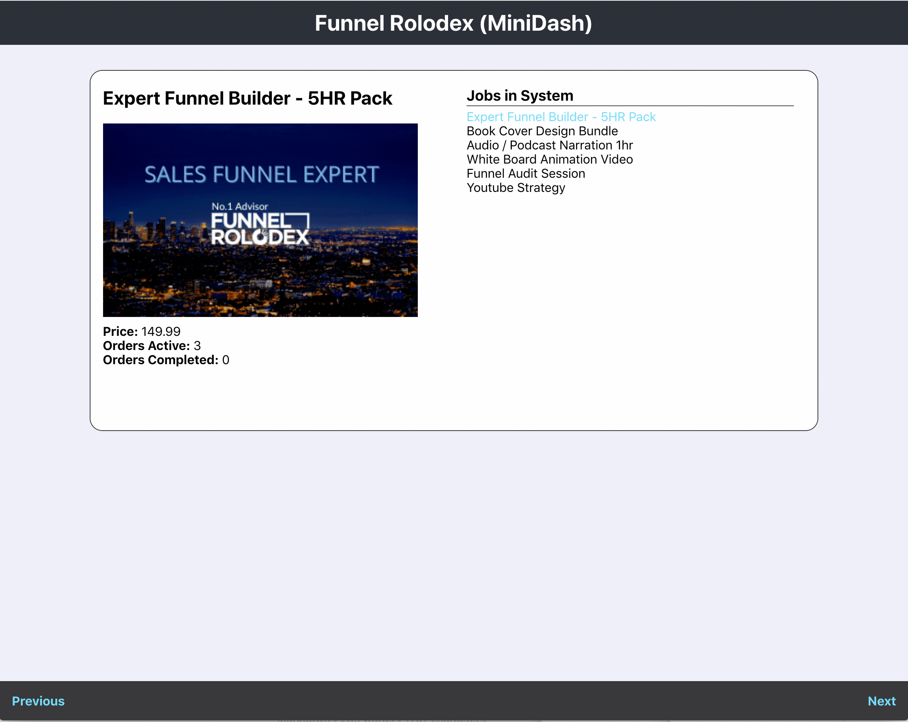

# Funnel Rolodex Candidate Solution

Welcome to the Funnel-Rolodex Candidate Solution project.  We have detailed instructions for how to get started and what a successful solution will entail.  Please read and follow these instructions so that it is clear the expectations.

## What it is we are building?

At Funnel Rolodex, our core business is as a marketplace that Sellers can post __JOBS__ and Buyers can purchase __ORDERS__ of those jobs.  Our challenge is to build a mini-dashboard that can displays a given set of jobs and their corresponding orders.



## What we provide?

### The Code Layout

Inside of this repository there are two directories:

```shell
.
├── front-end
└── local-api
```

The `front-end` folder is a __Create-React-App__ that we provide a skeleton set of CSS and React components to get started.  Your solution should implement a version of the UI pictured above, feel free to improve the design and add any improvements.  Your solution should communicate to the `local-api`, the default port is `3050`.  :warning: Do not use the __Remote-API__ as your data source.

The `local-api` folder contains a version of an Express-App API.  Inside of it we are expecting two endpoints to be implemented `/list` and `/jobs/:jobId` that act as a proxy to the __Remote-API-Source__.  There are integrations tests written in [Mocha](https://mochajs.org/) that we expect to pass.  You should not have to modify the tests.

### Remote-API Source

As mentioned we provide an external API that we expect you to build the local-api around as a proxy.  The following endpoints exist:

- [External-API: List Jobs](https://takehome-remote-source-api.herokuapp.com/list)
- [External-API: Job/:jobId ](https://takehome-remote-source-api.herokuapp.com/job/3)
- [External-API: Orders/:jobId ](https://takehome-remote-source-api.herokuapp.com/orders/3)


## What is a Successful Solution

We want to ensure you submit a successful solution so here is our assessment grading rubric.

|  | Task / Skill-Check   | Description                                                                         |
|---|-------------------|-------------------------------------------------------------------------------------|
| :thumbsup: | Code Complete        | Did you complete the assessment in it's entirety in terms of functionality          |
| :white_check_mark: | Build Passes | We expect `npm test` in `local-api` to pass, this is tied to a github/action. |
| :satellite: | API / Network Comms. | Were networking communications properly configured                                  |
| :bell: | App State Management | We recommend using React-State / Hooks                                              |
| :thought_balloon: | Pull-Request         | Open up a proper PR, **_read the submission process below_**                            |
| :shipit: | Commit History       | We value [conventional-commits](https://www.conventionalcommits.org/en/v1.0.0)      |

---

## Submitting a Solution

### 1. Setting Up Your Solution

> __IMPORTANT:__ When you receive this zip file create your repository and __COMMIT__ the code as the `initial commit` inside of the _default branch_ `main` or `master`.

### 2. Create a Branch & PR

You should begin to build your solution on a new branch (_we don't care what you call it we recommend_ --  `solution`).  Once you are code complete, create a private repository and push up both branches.  And open up a pull-request against the _default branch_ `main|master`.

### 3. Finalize & Submit

Once you are satisfied with your solution and the tests are passing.  Adding `mgan59` and `seointern` to the repository.  We also recommend assigning the PR to us so that we get notifications in our github-ui.

### 4. Review Process

Once the reviewers are added to the repository, we will conduct a quick PR review and setup a time to go over the code together.
